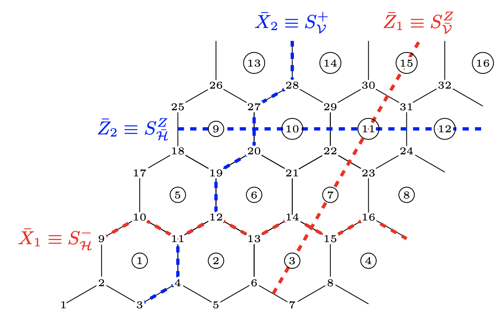

# Semion code neural-network decoder

A decoder for the semion code based on neural networks. The semion code is embedded on a hexagonal lattice with periodic boundary conditions (forming a torus), as the one shown below. These decoders are used in [arXiv:2002.08666
](https://arxiv.org/abs/2002.08666) to determine the error threshold of the semion code. In [arXiv:2002.08666
](https://arxiv.org/abs/2002.08666) the algorithm and training is explained in detail.

<!--  -->

  

The neural networks are trained to predict which logical error was produced by a simple decoder. Therefore the decoding process is turned into a classification task with 16 categories. Given the error syndrome, i.e., the 0 or 1 state of each vertex and plaquette in the lattice, the model has to predict the logical error.

## How to train a model

1. Produce the pattern data necessary to simulate the code. This data tells us how the code behaves under a X-Pauli errors.
2. Generate training data for the desired error rate and noise type.
3. Define the neural network and train.

These steps are shown in the notebook [training.ipynb](notebooks/training.ipynb). A more detailed explanation of the data format and data generation is given in [data_gen.ipynb](notebooks/data_gen.ipynb).
The code was run with Python 3.6 and TensorFlow 1.14.

## References
S. Varona, and M. A. Martin-Delgado, "Determination of the Semion Code Threshold using Neural Decoders", [arXiv:2002.08666
](https://arxiv.org/abs/2002.08666) (2020).
